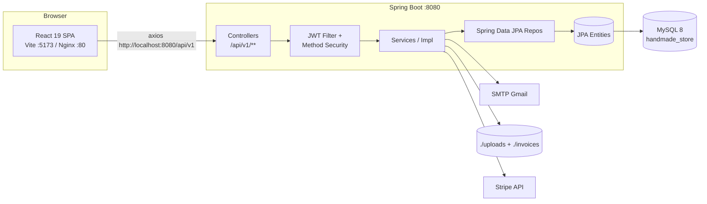
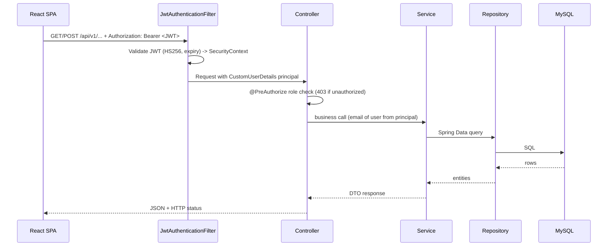
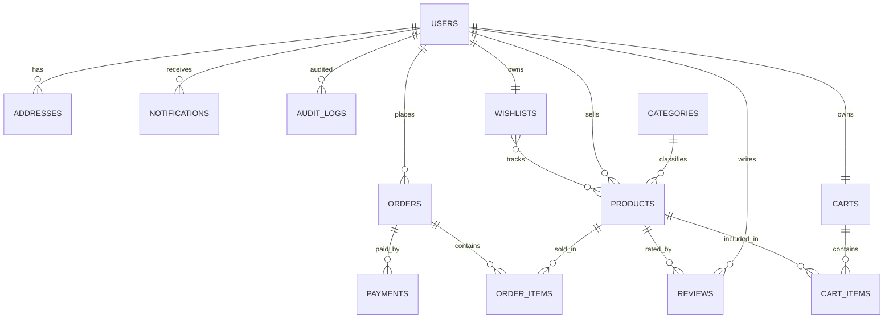
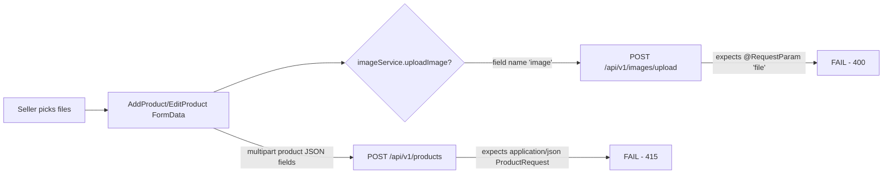
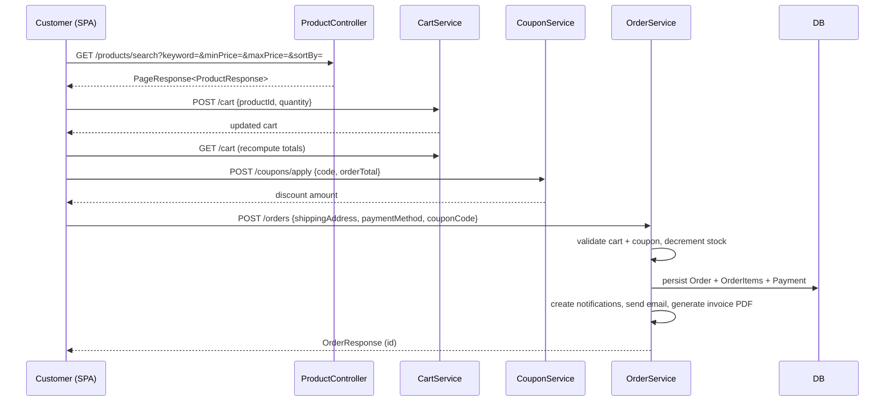

# Handmade Store — Full-Stack E-Commerce Project Documentation

> Generated from a full source-code audit of the `F:\Handmadestore` repository.
> This document describes the system **as implemented**, including known integration gaps and recommendations (see [Known Issues & Recommendations](#17-known-issues--recommendations)).

---

## Table of Contents

1. [Project Overview](#1-project-overview)
2. [Tech Stack](#2-tech-stack)
3. [System Architecture](#3-system-architecture)
4. [Repository Structure](#4-repository-structure)
5. [Backend — Layer by Layer](#5-backend--layer-by-layer)
6. [Database Schema & Relationships](#6-database-schema--relationships)
7. [Frontend — Layer by Layer](#7-frontend--layer-by-layer)
8. [Routing Map](#8-routing-map)
9. [Authentication & Authorization](#9-authentication--authorization)
10. [Image Handling](#10-image-handling)
11. [Key End-to-End Data Flows](#11-key-end-to-end-data-flows)
12. [Configuration & Environment Variables](#12-configuration--environment-variables)
13. [Build, Run & Deploy](#13-build-run--deploy)
14. [Testing](#14-testing)
15. [Dependencies](#15-dependencies)
16. [API Reference & Postman](#16-api-reference--postman)
17. [Known Issues & Recommendations](#17-known-issues--recommendations)

---

## 1. Project Overview

Handmade Store is a full-stack e-commerce platform for buying and selling handcrafted products (jewelry, pottery, textiles, home decor, woodwork, paintings). It has three user roles:

| Role | Responsibilities |
|------|------------------|
| **Customer** (`ROLE_CUSTOMER`) | Browse/search products, manage cart & wishlist, apply coupons, place orders, write reviews, manage profile & addresses, track orders |
| **Seller** (`ROLE_SELLER`) | Manage own products & stock, view seller dashboard analytics, fulfill seller orders |
| **Admin** (`ROLE_ADMIN`) | Platform dashboard, user management, product/category/coupon management, order status control, review moderation, audit logs |

The system supports Cash on Delivery and (API-level) Stripe payment, JWT-based authentication, email notifications (order confirmation / shipping / delivery / password OTP), PDF invoice generation, and image upload.

---

## 2. Tech Stack

### Backend
| Technology | Version / Detail |
|------------|------------------|
| Java | 21 (backend), 17 in CI test job |
| Spring Boot | 3.4.1 |
| Spring Security | stateless JWT (jjwt 0.12.6, HS256) |
| Spring Data JPA | Hibernate 6, `ddl-auto: update` |
| Database | MySQL 8 (prod), H2 in-memory (unit tests), PostgreSQL 15 (CI) |
| Validation | `spring-boot-starter-validation` |
| API Docs | SpringDoc OpenAPI 2.7.0 (Swagger UI at `/swagger-ui.html`) |
| Payments | Stripe Java SDK (checkout session + webhook) |
| Email | Spring Mail (`smtp.gmail.com:587`, STARTTLS) |
| PDF | Invoice generator writing to `./invoices` |
| Image | Local file system (`./uploads`) — see [§10](#10-image-handling) |
| Build | Maven, Lombok |
| Connection Pool | HikariCP (max 20) |

### Frontend
| Technology | Version / Detail |
|------------|------------------|
| React | 19 |
| Build tool | Vite 6 |
| Routing | React Router v7 (lazy-loaded) |
| State | Redux Toolkit 2.5 + React Redux |
| UI | React Bootstrap 5 / Bootstrap 5.3 |
| Icons | React Icons (Fi / feather set) |
| Charts | Chart.js + react-chartjs-2 |
| HTTP | Axios (hardcoded baseURL, JWT interceptor) |
| Notifications | React Toastify, SweetAlert2 |
| SEO | React Helmet Async |
| Loading | react-loading-skeleton |
| Dates | date-fns |
| Tests | Vitest + React Testing Library |

### DevOps
| Technology | Detail |
|------------|--------|
| Docker | 3 services (MySQL, backend, frontend) via `backend/docker-compose.yml` |
| Nginx | Serves SPA + proxies `/api/` → backend:8080 |
| CI/CD | GitHub Actions — backend tests, frontend lint/tests/build, Docker image builds |

---

## 3. System Architecture

### 3.1 High-level architecture



### 3.2 Request lifecycle (authenticated request)



### 3.3 Layering

- **Controller** layer exposes REST endpoints under `/api/v1`; each controller has `@CrossOrigin(origins = "http://localhost:5173")`.
- **Service** layer holds business logic. Each service is an interface with a `service/impl` implementation annotated `@Service` + `@Transactional`.
- **Repository** layer uses Spring Data JPA interfaces (with `JpaSpecificationExecutor` on `ProductRepository` for dynamic search).
- **Entity** layer maps to the DB via Hibernate; `ddl-auto: update` auto-creates/updates the schema on startup.

---

## 4. Repository Structure

```
F:\Handmadestore\
├── .github/workflows/
│   └── ci.yml                      # CI/CD pipeline
├── backend/
│   ├── Dockerfile                  # eclipse-temurin:21-jre
│   ├── docker-compose.yml          # mysql + backend + frontend
│   ├── pom.xml
│   ├── src/main/java/com/handmade/store/
│   │   ├── config/                 # SecurityConfig, CorsConfig, SwaggerConfig, DataSeeder
│   │   ├── controller/             # 19 REST controllers
│   │   ├── dto/                    # Request/response DTOs (14 packages)
│   │   ├── entity/                 # 15 JPA entities
│   │   ├── enums/                  # OrderStatus, PaymentStatus, PaymentMethod, ProductStatus, OtpType, Role
│   │   ├── exception/              # GlobalExceptionHandler + custom exceptions
│   │   ├── repository/             # 15 Spring Data repositories
│   │   ├── security/               # JwtTokenProvider, JwtAuthenticationFilter, CustomUserDetailsService, ...
│   │   ├── service/
│   │   │   ├── interface files
│   │   │   └── impl/               # service implementations
│   │   └── util/                   # ApiResponse, InvoiceGenerator, etc.
│   └── src/main/resources/
│       ├── application.yml         # main config
│       └── schema.sql              # CREATE DATABASE handmade_store
│   └── src/test/                   # unit tests (H2)
│       ├── java/com/handmade/store/
│       │   ├── HandmadeStoreApplicationTests.java
│       │   └── controller/         # AuthControllerTest, ProductControllerTest
│       └── resources/application-test.yml
├── frontend/
│   ├── Dockerfile                  # node:20 build -> nginx:alpine
│   ├── nginx.conf                  # SPA fallback + /api/ proxy
│   ├── index.html
│   ├── package.json
│   ├── vite.config.js
│   ├── vitest.config.js
│   └── src/
│       ├── main.jsx                # Store + BrowserRouter + HelmetProvider + ToastContainer
│       ├── App.jsx                 # Lazy route tree
│       ├── components/
│       │   ├── common/             # ErrorBoundary, Loader, LoadingSpinner, LowStockBadge,
│       │   │                       # OtpVerification, Pagination, ProductSkeleton, ProtectedRoute,
│       │   │                       # RecentlyViewed, RecommendedProducts, SearchAutocomplete
│       │   ├── layout/             # Navbar, Footer, Layout, AdminLayout, SellerLayout
│       │   └── product/            # ProductCard, ProductZoom
│       ├── context/                # ThemeContext (dark/light)
│       ├── hooks/                  # useDebounce, useLocalStorage, useRecentlyViewed, useTheme
│       ├── pages/
│       │   ├── admin/              # AdminDashboard, AdminUsers, AdminProducts, AdminCategories,
│       │   │                       # AdminOrders, AdminCoupons, AdminReviews
│       │   ├── auth/               # LoginPage, RegisterPage, ForgotPasswordPage, ResetPasswordPage
│       │   ├── common/             # NotFoundPage
│       │   ├── customer/           # HomePage, ShopPage, ProductDetailPage, CartPage, CheckoutPage,
│       │   │                       # OrderHistoryPage, OrderDetailPage, WishlistPage, ProfilePage
│       │   └── seller/             # SellerDashboard, SellerProducts, AddProduct, EditProduct,
│       │                           # SellerOrders, SellerEarnings
│       ├── redux/
│       │   ├── store/store.js      # configureStore (13 slices)
│       │   └── slices/             # auth, products, cart, wishlist, orders, user, categories,
│       │                           # reviews, coupons, notifications, admin, seller, address
│       ├── routes/                 # duplicate ProtectedRoute (see Known Issues)
│       ├── services/               # api.js + per-domain axios service modules
│       ├── utils/                  # constants.js, helpers.js
│       └── __tests__/              # authSlice, LoginPage, Navbar, App tests
├── README.md                       # setup guide + default credentials
├── HandmadeStore.postman_collection.json
└── PROJECT_DOCUMENTATION.md        # this file
```

---

## 5. Backend — Layer by Layer

### 5.1 Controllers & Endpoint Map

Base path for all endpoints is **`/api/v1`**. Auth column indicates the role requirement; **Public** endpoints need no token.

#### Auth (`/auth`) — `AuthController`
| Method | Path | Auth | Description |
|--------|------|------|-------------|
| POST | `/auth/register` | Public | Register customer; returns JWT + refresh token + user |
| POST | `/auth/login` | Public | Login; returns JWT + refresh token + user |
| POST | `/auth/forgot-password` | Public | Sends 6-digit OTP to email |
| POST | `/auth/reset-password` | Public | Resets password using OTP |
| POST | `/auth/refresh-token` | Public | Exchanges refresh token for a new access token |

#### Products (`/products`) — `ProductController`
| Method | Path | Auth | Description |
|--------|------|------|-------------|
| GET | `/products` | Public | Paginated list (`Pageable`) |
| GET | `/products/{id}` | Public | Product detail |
| GET | `/products/search` | Public | Search/filter: `keyword`, `categoryId`, `minPrice`, `maxPrice`, `sortBy`, `sortDir` |
| GET | `/products/featured` | Public | Featured products |
| GET | `/products/category/{categoryId}` | Public | Products by category |
| GET | `/products/seller` | SELLER/ADMIN | Products of current seller |
| POST | `/products` | SELLER/ADMIN | Create product (`ProductRequest` JSON) |
| PUT | `/products/{id}` | SELLER/ADMIN | Update product (ownership enforced) |
| DELETE | `/products/{id}` | SELLER/ADMIN | Delete product (ownership enforced) |
| PUT | `/products/{id}/stock` | SELLER/ADMIN | Set stock quantity |
| PUT | `/products/{id}/featured` | ADMIN | Toggle featured flag |

#### Categories (`/categories`) — `CategoryController`
| Method | Path | Auth | Description |
|--------|------|------|-------------|
| GET | `/categories` | Public | All categories |
| GET | `/categories/{id}` | Public | Category by id |
| GET | `/categories/root` | Public | Root categories |
| GET | `/categories/parent/{parentId}` | Public | Children of a category |
| POST | `/categories` | ADMIN | Create category |
| PUT | `/categories/{id}` | ADMIN | Update category |
| DELETE | `/categories/{id}` | ADMIN | Delete category |

#### Cart (`/cart`) — `CartController`
| Method | Path | Auth | Description |
|--------|------|------|-------------|
| GET | `/cart` | Authenticated | Get current user's cart |
| POST | `/cart` | Authenticated | Add item (`{productId, quantity}`) |
| PUT | `/cart/{productId}` | Authenticated | Update item quantity |
| DELETE | `/cart/{productId}` | Authenticated | Remove item |
| DELETE | `/cart` | Authenticated | Clear cart |

#### Orders (`/orders`) — `OrderController`
| Method | Path | Auth | Description |
|--------|------|------|-------------|
| POST | `/orders` | Customer | Place order (`OrderRequest`: `shippingAddress`, `paymentMethod`, `couponCode`, `notes`) |
| GET | `/orders` | Customer | User's orders (paginated) |
| GET | `/orders/{id}` | Customer | Order detail (ownership enforced) |
| PUT | `/orders/{id}/cancel` | Customer | Cancel order |
| GET | `/orders/seller` | SELLER/ADMIN | Orders for current seller |

#### Reviews (`/reviews`) — `ReviewController`
| Method | Path | Auth | Description |
|--------|------|------|-------------|
| POST | `/reviews/product/{productId}` | Customer | Add review |
| GET | `/reviews/product/{productId}` | Public | Reviews for product |
| GET | `/reviews/product/{productId}/can-review` | Customer | Whether user may review |
| PUT | `/reviews/{id}` | Authenticated | Update own review |
| DELETE | `/reviews/{id}` | Authenticated/Admin | Delete review |

#### Users (`/users`) — `UserController`
| Method | Path | Auth | Description |
|--------|------|------|-------------|
| GET | `/users/me` | Authenticated | Current profile |
| PUT | `/users/me` | Authenticated | Update profile |
| PUT | `/users/me/change-password` | Authenticated | Change password |
| GET | `/users` | ADMIN | List all users |
| GET | `/users/{id}` | ADMIN | User by id |
| PUT | `/users/{id}/role` | ADMIN | Change user role |
| PUT | `/users/{id}/toggle` | ADMIN | Enable/disable user |

#### Admin (`/admin`) — `AdminController` (all `hasRole('ADMIN')`)
| Method | Path | Description |
|--------|------|-------------|
| GET | `/admin/dashboard` | Platform stats + charts |
| GET | `/admin/orders` | All orders |
| PUT | `/admin/orders/{id}/status` | Update order status |
| GET | `/admin/orders/status/{status}` | Orders by status |
| GET | `/admin/coupons` | List coupons |
| POST | `/admin/coupons` | Create coupon |
| PUT | `/admin/coupons/{id}` | Update coupon |
| DELETE | `/admin/coupons/{id}` | Delete coupon |
| GET | `/admin/reviews` | All reviews |
| DELETE | `/admin/reviews/{id}` | Delete review |
| GET | `/admin/notifications` | All platform notifications |

#### Seller (`/seller`) — `SellerController`
| Method | Path | Auth | Description |
|--------|------|------|-------------|
| GET | `/seller/dashboard` | SELLER/ADMIN | Seller stats |
| GET | `/seller/orders` | SELLER/ADMIN | Seller's orders |
| PUT | `/seller/orders/{id}/status` | SELLER/ADMIN | Advance seller order status |

#### Coupons (`/coupons`) — `CouponController`
| Method | Path | Auth | Description |
|--------|------|------|-------------|
| POST | `/coupons/apply` | Authenticated | Validate + apply coupon against an order total |
| GET | `/coupons/{code}/validate` | Authenticated | Validate a coupon code |

#### Addresses (`/addresses`) — `AddressController`
| Method | Path | Auth | Description |
|--------|------|------|-------------|
| GET | `/addresses` | Authenticated | List addresses |
| POST | `/addresses` | Authenticated | Create address |
| PUT | `/addresses/{id}` | Authenticated | Update address |
| DELETE | `/addresses/{id}` | Authenticated | Delete address |
| PUT | `/addresses/{id}/default` | Authenticated | Set default address |

#### Wishlist (`/wishlist`) — `WishlistController`
| Method | Path | Auth | Description |
|--------|------|------|-------------|
| GET | `/wishlist` | Authenticated | Get wishlist |
| POST | `/wishlist` | Authenticated | Add product |
| DELETE | `/wishlist/{productId}` | Authenticated | Remove product |

#### Notifications (`/notifications`) — `NotificationController`
| Method | Path | Auth | Description |
|--------|------|------|-------------|
| GET | `/notifications` | Authenticated | List notifications |
| GET | `/notifications/unread-count` | Authenticated | Unread count (badge) |
| PUT | `/notifications/{id}/read` | Authenticated | Mark one read |
| PUT | `/notifications/read-all` | Authenticated | Mark all read |

#### Payments (`/payments`) — `PaymentController`
| Method | Path | Auth | Description |
|--------|------|------|-------------|
| POST | `/payments/create-checkout-session` | Authenticated | Create Stripe Checkout Session for an order |
| POST | `/payments/webhook` | ⚠️ (see Known Issues) | Stripe webhook: payload + `Stripe-Signature` header |
| GET | `/payments` | Authenticated | Payments of current user |

#### Images (`/images`) — `ImageController`
| Method | Path | Auth | Description |
|--------|------|------|-------------|
| POST | `/images/upload` | Authenticated | Multipart upload, **param name `file`**; returns `{url}` |

#### OTP (`/otp`) — `OtpController`
| Method | Path | Auth | Description |
|--------|------|------|-------------|
| POST | `/otp/generate` | Authenticated | Generate OTP (REGISTRATION / EMAIL_VERIFICATION) |
| POST | `/otp/verify` | Authenticated | Verify OTP |

#### Invoices (`/invoices`) — `InvoiceController`
| Method | Path | Auth | Description |
|--------|------|------|-------------|
| GET | `/invoices/order/{orderId}/download` | Authenticated | Download PDF invoice |

#### Inventory (`/inventory`) — `LowStockController`
| Method | Path | Auth | Description |
|--------|------|------|-------------|
| GET | `/inventory/low-stock` | SELLER/ADMIN | Products below stock threshold |
| POST | `/inventory/check` | ADMIN | Stock check |

#### Audit (`/audit`) — `AuditController` (all ADMIN)
| Method | Path | Description |
|--------|------|-------------|
| GET | `/audit` | All audit logs |
| GET | `/audit/entity/{entity}` | Audit logs by entity |
| GET | `/audit/user/{userId}` | Audit logs by user |

### 5.2 Security Layer (`security` package)

| Class | Responsibility |
|-------|----------------|
| `JwtTokenProvider` | Generates/parses HS256 JWTs using a Base64 secret from `jwt.secret`; access TTL `jwt.expiration` (24h), refresh TTL `jwt.refreshExpiration` (7d) |
| `JwtAuthenticationFilter` | `OncePerRequestFilter`: reads `Authorization: Bearer <token>`, validates, populates `SecurityContext` with `CustomUserDetails` |
| `CustomUserDetailsService` | Loads user by email → `CustomUserDetails` (implements `UserDetails`, exposes id, name, role) |
| `JwtAuthenticationEntryPoint` | Returns 401 JSON for unauthenticated access |
| `JwtAccessDeniedHandler` | Returns 403 JSON for authenticated-but-unauthorized access |

`SecurityConfig` rules (in order):
1. CSRF disabled, CORS enabled, **stateless** sessions.
2. **Permit all:** `POST /api/v1/auth/**`, `GET /api/v1/products/**`, `GET /api/v1/categories/**`, `GET /api/v1/reviews/product/**`, `GET /uploads/**`, Swagger (`/v3/api-docs/**`, `/swagger-ui/**`, `/swagger-ui.html`).
3. `hasRole("ADMIN")` for `/api/v1/admin/**`; `hasRole("SELLER")` for `/api/v1/seller/**`.
4. **All other requests require authentication.**
5. `@EnableMethodSecurity` enables `@PreAuthorize` on controllers/services (see §5.1).

> ⚠️ Consequences of rule 4: `POST /api/v1/images/upload` and `POST /api/v1/payments/webhook` are **not** in the permit-list, so they require a JWT even though callers (image upload, Stripe webhook) often won't have one.

### 5.3 Entities

| Entity | Table | Purpose |
|--------|-------|---------|
| `User` | `users` | Account (name, email, password hash, phone, avatar, role, enabled) |
| `Product` | `products` | Product + seller FK, category FK, price/discount, stock, images set, rating |
| `Category` | `categories` | Category tree (self-referencing `parent`) |
| `Cart` | `carts` | One cart per user |
| `CartItem` | `cart_items` | Product + quantity + snapshot price in a cart |
| `Order` | `orders` | Order header (user FK, totals, statuses, shipping address, tracking) |
| `OrderItem` | `order_items` | Product + quantity + snapshot price in an order |
| `Review` | `reviews` | Rating + comment + images for a product |
| `Address` | `addresses` | Shipping/billing address for a user, `isDefault` |
| `Payment` | `payments` | Payment record (order FK, amount, Stripe ids, method, status) |
| `Coupon` | `coupons` | Discount code, percentage, caps, usage limits, validity window |
| `Wishlist` | `wishlists` | User wishlist (ManyToMany products) |
| `Notification` | `notifications` | In-app notifications per user |
| `OtpVerification` | `otp_verifications` | 6-digit OTP, type, expiry, used flag |
| `AuditLog` | `audit_logs` | Action trail (user, action, entity, old/new values, IP) |

### 5.4 Enums
- `OrderStatus`: `PENDING, CONFIRMED, SHIPPED, OUT_FOR_DELIVERY, DELIVERED, CANCELLED, RETURNED, REFUNDED`
- `PaymentStatus`: `PENDING, COMPLETED, FAILED, REFUNDED`
- `PaymentMethod`: `STRIPE, RAZORPAY, COD`
- `ProductStatus`: `ACTIVE, INACTIVE, OUT_OF_STOCK, DISCONTINUED`
- `OtpType`: `REGISTRATION, PASSWORD_RESET, EMAIL_VERIFICATION`
- `Role`: `ROLE_CUSTOMER, ROLE_SELLER, ROLE_ADMIN` (implements `GrantedAuthority`; `getAuthority()` returns the enum name)

### 5.5 Repositories
Spring Data JPA interfaces; highlights:
- `ProductRepository` extends `JpaSpecificationExecutor` → dynamic `Specification`-based search/filter used by `searchProducts`.
- `UserRepository` — `findByEmail`, existence checks, role queries.
- `OrderRepository` — user/seller/status queries, revenue aggregates for dashboards.
- `CategoryRepository`, `CouponRepository` (findByCode, active windows), `ReviewRepository` (aggregate rating), `PaymentRepository`, `NotificationRepository` (unread count), `OtpVerificationRepository`, `WishlistRepository`, `CartRepository`, `CartItemRepository`, `OrderItemRepository`, `AddressRepository`, `AuditLogRepository`.

### 5.6 Services (business logic)
| Service | Key behavior |
|---------|--------------|
| `AuthService` | Register (creates a `Cart` for the new user), login (returns token + refreshToken + `UserResponse`), forgot/reset password with OTP, refresh token |
| `ProductService` | CRUD with seller ownership checks, search/filter/sort via `Specification`, featured handling, stock updates |
| `CategoryService` | CRUD + tree handling |
| `CartService` | Add/update/remove/clear, price snapshot, recompute totals |
| `OrderService` | `placeOrder`: validates cart & coupon, computes discount/shipping, decrements stock, branches on `paymentMethod` (COD / STRIPE / RAZORPAY), creates `Payment`, sends notifications + emails, generates PDF invoice; cancel + seller view |
| `PaymentService` | Stripe Checkout session creation, webhook signature verification, marks `Payment` PENDING→COMPLETED, updates order `paymentStatus`/`orderStatus`, sends confirmation |
| `ReviewService` | Add (rating aggregation on product), update, delete, "can-review" check |
| `WishlistService` | Add/remove/list |
| `AddressService` | CRUD + default address handling |
| `CouponService` | Uppercases code, validates active window/min-purchase/usage limit, computes discount capped by `maxDiscount`, increments `usedCount` |
| `NotificationService` | Create + fetch + mark-read |
| `OtpService` | Generates 6-digit OTP (10 min expiry), marks old unused OTPs as used, verifies + invalidates |
| `ImageService` | Validates content-type (jpeg/png/webp/gif) and ≤5MB, writes UUID-named file to `app.upload.dir`, returns `/uploads/<filename>` |
| `EmailService` | HTML templates: order confirmation, shipping, delivery, password OTP |
| `DashboardService` | `AdminDashboardResponse` + `SellerDashboardResponse` aggregates (revenue, orders, top products, chart series) |
| `LowStockService` | Products below threshold |
| `AuditService` | Records and queries audit logs |

### 5.7 Exception Handling
`GlobalExceptionHandler` (`@RestControllerAdvice`) maps:
- `ResourceNotFoundException` → 404
- `BadRequestException` → 400
- `MethodArgumentNotValidException` → 400 (validation messages)
- `AuthenticationException` → 401
- `AccessDeniedException` → 403
- `Exception` → 500 (generic)

Response shape: `{ status, message, timestamp, ... }`.

### 5.8 Configuration Classes
| Class | Purpose |
|-------|---------|
| `SecurityConfig` | Filter chain (see §5.2) |
| `CorsConfig` | CORS from `app.cors.allowed-origins` + static resource handler `/uploads/**` → `app.upload.dir` |
| `SwaggerConfig` | OpenAPI info + bearer scheme |
| `DataSeeder` | `@Profile("!test")`; seeds roles/users/categories/products/reviews/coupons only when the `users` table is empty |

### 5.9 DataSeeder (default data)
- **Users** (`admin@handmade.com`/`admin123`, `seller1@handmade.com`/`seller123`, `seller2@handmade.com`/`seller123`, `customer1@handmade.com`/`customer123`, `customer2@handmade.com`/`customer123`).
- **Categories**: Jewelry, Home Decor, Pottery, Textiles, Woodwork, Paintings.
- **Sample products** (with seller assignment, images, stock, pricing).
- **Coupons**: `WELCOME10` (10% off, max ₹200, min purchase ₹500, 90 days), `FLAT200` (20% capped ₹200, min ₹1000, 60 days).
- **Sample reviews** and ratings.

---

## 6. Database Schema & Relationships

Hibernate creates tables via `ddl-auto: update`. `schema.sql` only issues `CREATE DATABASE IF NOT EXISTS handmade_store`.

### 6.1 Entity-relationship diagram



### 6.2 Key tables & columns

**users** — `id`, `first_name`, `last_name`, `email` (unique), `password` (BCrypt), `phone`, `avatar`, `role` (enum string), `enabled`, `created_at`, `updated_at`.

**products** — `id`, `name`, `description`, `price`, `discount_price`, `sku`, `stock_quantity`, `image_url`, `images` (element-collection table `product_images`), `category_id` (FK), `seller_id` (FK users), `rating`, `review_count`, `status` (enum string), `is_featured`, `created_at`, `updated_at`.

**categories** — `id`, `name`, `description`, `image_url`, `parent_id` (FK, self), `created_at`, `updated_at`.

**carts** — `id`, `user_id` (FK unique), `created_at`, `updated_at`.

**cart_items** — `id`, `cart_id` (FK), `product_id` (FK), `quantity`, `price` (snapshot), `created_at`.

**orders** — `id`, `user_id` (FK), `total_amount`, `shipping_address`, `order_status` (enum), `payment_status` (enum), `payment_method` (enum), `tracking_number`, `notes`, `created_at`, `updated_at`.

**order_items** — `id`, `order_id` (FK), `product_id` (FK), `quantity`, `price` (snapshot), `created_at`.

**payments** — `id`, `order_id` (FK), `user_id` (FK), `amount`, `stripe_payment_id`, `stripe_session_id`, `payment_method` (enum), `payment_status` (enum, default PENDING), `created_at`.

**reviews** — `id`, `user_id` (FK), `product_id` (FK), `rating` (1–5), `comment`, `images` (element-collection table `review_images`), `created_at`, `updated_at`.

**coupons** — `id`, `code` (unique), `discount_percentage`, `max_discount`, `min_purchase`, `usage_limit`, `used_count` (default 0), `valid_from`, `valid_until`, `active`, `created_at`.

**addresses** — `id`, `user_id` (FK), `street`, `city`, `state`, `zip_code`, `country`, `is_default`, `created_at`, `updated_at`.

**wishlists** — `id`, `user_id` (FK unique), join table `wishlist_products` (`wishlist_id`, `product_id`), `created_at`, `updated_at`.

**notifications** — `id`, `user_id` (FK), `title`, `message`, `is_read`, `link`, `created_at`.

**otp_verifications** — `id`, `email`, `otp`, `type` (enum), `expiry_time`, `used`, `created_at`.

**audit_logs** — `id`, `user_id`, `action`, `entity`, `entity_id`, `old_values`, `new_values`, `ip_address`, `created_at`.

---

## 7. Frontend — Layer by Layer

### 7.1 Startup chain
`main.jsx` → `Redux <Provider store>` → `BrowserRouter` → `HelmetProvider` → `<ToastContainer>` → `<App/>`.

`App.jsx`:
- Global `<Helmet>` SEO meta tags.
- `ThemeProvider` wraps everything; `ErrorBoundary` guards the route tree.
- All pages are `React.lazy()` loaded inside `<Suspense>` with a spinner fallback.
- Layouts: `CustomerLayout` (Navbar + main + Footer) for public/customer pages; `AdminLayout` and `SellerLayout` for role-scoped areas.

### 7.2 Routing Map
| Path | Page | Guard |
|------|------|-------|
| `/` | HomePage | Public |
| `/login`, `/register`, `/forgot-password`, `/reset-password` | Auth pages | Public |
| `/shop` | ShopPage | Public |
| `/product/:id` | ProductDetailPage | Public |
| `/cart`, `/checkout`, `/orders`, `/orders/:id`, `/wishlist`, `/profile` | Customer pages | `ProtectedRoute` (login required) |
| `/seller/dashboard`, `/seller/products`, `/seller/products/add`, `/seller/products/edit/:id`, `/seller/orders`, `/seller/earnings` | Seller pages | `RoleBasedRoute` → `ROLE_SELLER` |
| `/admin/dashboard`, `/admin/users`, `/admin/products`, `/admin/categories`, `/admin/orders`, `/admin/coupons`, `/admin/reviews` | Admin pages | `RoleBasedRoute` → `ROLE_ADMIN` |
| `*` | NotFoundPage | Public |

> ℹ️ The Navbar links to `/notifications`, but **no such route is registered** in `App.jsx` (would hit NotFoundPage). See Known Issues.

### 7.3 Redux Store (13 slices)
`redux/store/store.js` — `configureStore` with: `auth, products, cart, wishlist, orders, user, categories, reviews, coupons, notifications, admin, seller, address`.

Notable slice behaviors (`redux/slices/authSlice.js`):
- `loginUser` / `registerUser` persist `token` and `user` into `localStorage` and set the axios default `Authorization` header.
- `logoutUser`, `forgotPassword`, `resetPassword`, `loadUser` (`GET /users/me`), `refreshToken` thunks exist.
- Selectors: `selectCurrentUser`, `selectIsAuthenticated`, `selectAuthLoading`, `selectAuthError`, `selectToken`.

### 7.4 API layer
`services/api.js`:
- `baseURL: 'http://localhost:8080/api/v1'` (hardcoded; `utils/constants.js` exports `API_BASE_URL = '/api/v1'` but it is **not** used here).
- Request interceptor injects `Authorization: Bearer <token>` from `localStorage`.
- Response interceptor: on **401**, clears auth state and hard-redirects to `/login`.

Per-domain services: `authService, productService, cartService, orderService, wishlistService, reviewService, userService, addressService, categoryService, couponService, notificationService, otpService, imageService, adminService, sellerService`.

### 7.5 Pages by role
- **Customer**: HomePage (featured/recent/hero), ShopPage (search + filters + sort + pagination via `?keyword=`), ProductDetailPage (image zoom, reviews, recently-viewed, recommended, add-to-cart), CartPage, CheckoutPage (3-step wizard), OrderHistoryPage, OrderDetailPage (status timeline), WishlistPage, ProfilePage.
- **Auth**: LoginPage (remember-me, redirect back to originating path), RegisterPage, ForgotPasswordPage, ResetPasswordPage (OTP).
- **Seller**: SellerDashboard (charts), SellerProducts, AddProduct, EditProduct, SellerOrders, SellerEarnings.
- **Admin**: AdminDashboard (stats/charts), AdminUsers, AdminProducts, AdminCategories, AdminOrders, AdminCoupons, AdminReviews.

### 7.6 Key components & hooks
- `components/common/`: `ErrorBoundary`, `Loader`, `LoadingSpinner`, `LowStockBadge`, `OtpVerification`, `Pagination`, `ProductSkeleton`, `ProtectedRoute` (+ `RoleBasedRoute`), `RecentlyViewed`, `RecommendedProducts`, `SearchAutocomplete`.
- `components/layout/`: `Navbar` (cart/wishlist/notification badges, theme toggle, role-based menu), `Footer`, `Layout`, `AdminLayout`, `SellerLayout`.
- `components/product/`: `ProductCard`, `ProductZoom`.
- `hooks/`: `useDebounce`, `useLocalStorage`, `useRecentlyViewed` (localStorage `recentlyViewed`, max 10), `useTheme`.
- `context/ThemeContext.jsx`: dark/light mode persisted via localStorage.
- `utils/helpers.js`: `formatPrice` (₹), `formatDate`, status badge maps, email validation.
- `utils/constants.js`: `ROLES`, `ORDER_STATUSES`, `PAYMENT_METHODS`, `PRODUCT_STATUSES`, `ITEMS_PER_PAGE=12`, `CLOUDINARY_UPLOAD_PRESET='handmade_store'`, `STRIPE_PUBLIC_KEY` (from `VITE_STRIPE_PUBLIC_KEY`).

---

## 8. Routing Map (Frontend — expanded)

See §7.2. The `ProtectedRoute`/`RoleBasedRoute` guard composition:
```
<ProtectedRoute>            // authenticated?
  <CustomerLayout>...</CustomerLayout>
</ProtectedRoute>

<RoleBasedRoute allowedRoles={['ROLE_SELLER']}>   // authenticated + role match
  <SellerLayout>...
</RoleBasedRoute>
```
- Not logged in → redirected to `/login` (preserving `state.from`).
- Wrong role → redirected to `/` (or blocked).

---

## 9. Authentication & Authorization

### 9.1 Registration flow
1. `POST /auth/register` with `{firstName, lastName, email, password, phone}`.
2. Backend validates email uniqueness, encodes password (BCrypt), creates `User` with `ROLE_CUSTOMER`, creates an empty `Cart`.
3. Returns `{ token, refreshToken, user }`; frontend stores them and sets the auth header.

### 9.2 Login flow
1. `POST /auth/login` → server verifies password → returns `{ token, refreshToken, user }`.
2. Frontend persists token + user to `localStorage`; `authSlice` sets `isAuthenticated = true`.
3. Every subsequent request includes `Authorization: Bearer <token>`.
4. On **401**, the axios interceptor clears storage and redirects to `/login`.

### 9.3 Token details
- Signed **HS256** with `jwt.secret` (Base64), via jjwt 0.12.6.
- Access token TTL: **86400000 ms (24h)**; refresh token TTL: **604800000 ms (7d)**.
- `POST /auth/refresh-token` accepts `{ refreshToken }` and returns a new access token.

### 9.4 Password reset (OTP)
1. `POST /auth/forgot-password` `{email}` → `OtpService` creates 6-digit OTP (`OtpType.PASSWORD_RESET`, 10 min expiry) and emails it.
2. `POST /auth/reset-password` `{email, otp, newPassword}` → verifies OTP, marks used, updates password.

### 9.5 Authorization on the frontend
- `ProtectedRoute` gates customer-only routes.
- `RoleBasedRoute` gates seller/admin areas based on `user.role` (stored as `ROLE_*`).
- Navbar conditionally renders Seller Dashboard / Admin Panel by role.
- Backend remains the source of truth: every privileged endpoint re-checks `@PreAuthorize` / URL rules.

---

## 10. Image Handling

### 10.1 As implemented (local file system)


- Backend `ImageServiceImpl` validates `image/jpeg|png|webp|gif` and ≤ 5 MB, writes a UUID-named file into `app.upload.dir` (`./uploads`), and returns `"/uploads/<filename>"`.
- `CorsConfig` serves those files at `GET /uploads/**`.
- The **Cloudinary** config in `application.yml` is present but **unused** by any service; the implemented image service is purely local-file based.

### 10.2 Frontend/backend contract mismatch (⚠️)
| Layer | What it sends/expects |
|-------|----------------------|
| `services/imageService.js` | `formData.append('image', file)` → `/images/upload` |
| `ImageController.uploadImage` | expects `@RequestParam("file")` → **400 Bad Request** with the current frontend |
| `AddProduct.jsx` / `EditProduct.jsx` | submits `FormData` fields `name, description, sku, categoryId, price, discountPrice, stockQuantity, featured, mainImage (file), images (files[,])` |
| `ProductController.createProduct` | expects JSON `ProductRequest` (`imageUrl` + `images: Set<String>`) → **415/400** with the current frontend |

Net effect: the "Add/Edit Product" and direct image-upload flows in the UI do not currently match the backend contract. See [§17](#17-known-issues--recommendations).

---

## 11. Key End-to-End Data Flows

### 11.1 Browse → Cart → Checkout → Order


### 11.2 Order status lifecycle (server-driven)
`PENDING → CONFIRMED → SHIPPED → OUT_FOR_DELIVERY → DELIVERED` (with `CANCELLED`/`RETURNED`/`REFUNDED` side states). Admin (`/admin/orders/{id}/status`) and Seller (`/seller/orders/{id}/status`) drive transitions; each transition can trigger the email service.

### 11.3 Stripe payment (API level, not wired in UI)
1. `POST /orders` creates the order with `paymentMethod=STRIPE` (payment stays `PENDING`).
2. `POST /payments/create-checkout-session {orderId}` → Stripe Checkout URL.
3. Stripe posts to `POST /payments/webhook` (signature verified) → `PaymentServiceImpl` marks payment `COMPLETED` and updates the order.

> ⚠️ The current `CheckoutPage` does **not** call `create-checkout-session`; it places the order directly and redirects to order detail, so online payment is effectively not reachable from the UI.

### 11.4 Dashboard data flow
- `GET /admin/dashboard` / `GET /seller/dashboard` → `DashboardService` aggregates repository queries (revenue, order counts, top sellers/products, chart series) → `AdminDashboardResponse` / `SellerDashboardResponse` → Chart.js charts in `AdminDashboard.jsx` / `SellerDashboard.jsx`.

---

## 12. Configuration & Environment Variables

### 12.1 Backend (`backend/src/main/resources/application.yml`)
| Key | Default | Purpose |
|-----|---------|---------|
| `server.port` | 8080 | API port |
| `spring.datasource.url` | `jdbc:mysql://localhost:3306/handmade_store?createDatabaseIfNotExist=true&...` | MySQL (auto-creates DB) |
| `spring.datasource.username` | root | DB user |
| `spring.datasource.password` | root | DB password |
| `spring.datasource.hikari.maximum-pool-size` | 20 | Hikari pool |
| `spring.jpa.hibernate.ddl-auto` | update | Auto DDL |
| `spring.mail.host/port` | smtp.gmail.com:587 | SMTP |
| `spring.mail.username` | `${MAIL_USERNAME:your-email@gmail.com}` | Gmail account |
| `spring.mail.password` | `${MAIL_PASSWORD:your-app-password}` | Gmail app password |
| `spring.servlet.multipart.max-file-size` | 10MB | Upload cap per file |
| `spring.servlet.multipart.max-request-size` | 20MB | Upload cap per request |
| `jwt.secret` | Base64 HS256 key (committed) | JWT signing |
| `jwt.expiration` | 86400000 | Access TTL (ms) |
| `jwt.refreshExpiration` | 604800000 | Refresh TTL (ms) |
| `stripe.secret-key` | `${STRIPE_SECRET_KEY:sk_test_...}` | Stripe server key |
| `stripe.publishable-key` | `${STRIPE_PUBLISHABLE_KEY:pk_test_...}` | Stripe client key |
| `stripe.webhook-secret` | `${STRIPE_WEBHOOK_SECRET:whsec_...}` | Webhook signature secret |
| `cloudinary.cloud-name/api-key/api-secret` | `${CLOUDINARY_*:...}` | **Unused** by implemented code |
| `app.cors.allowed-origins` | `http://localhost:5173,http://localhost:3000` | CORS origins |
| `app.invoice.storage-path` | `./invoices` | PDF output dir |
| `app.upload.dir` | `./uploads` | Local image upload dir |
| `springdoc.swagger-ui.path` | `/swagger-ui.html` | Swagger UI |

### 12.2 Backend test profile (`application-test.yml`)
H2 in-memory (`jdbc:h2:mem:testdb`), `ddl-auto: create-drop`, fake JWT/Stripe/Cloudinary values.

### 12.3 Frontend
| Variable | Default | Purpose |
|----------|---------|---------|
| `VITE_STRIPE_PUBLIC_KEY` | `''` | Stripe publishable key (used in `STRIPE_PUBLIC_KEY`) |
| Axios `baseURL` | `http://localhost:8080/api/v1` | API base (hardcoded in `services/api.js`) |
| `CLOUDINARY_UPLOAD_PRESET` | `handmade_store` | Referenced but Cloudinary is not implemented end-to-end |

### 12.4 Docker (`backend/docker-compose.yml`)
| Container | Image | Port | Env |
|-----------|-------|------|-----|
| `handmade-mysql` | mysql:8.0 | 3306 | root pass `root123`, DB `handmade_store`, user `handmade`/`handmade123` |
| `handmade-backend` | eclipse-temurin:21-jre | 8080 | `SPRING_DATASOURCE_URL=jdbc:mysql://mysql:3306/handmade_store`, `SPRING_DATASOURCE_USERNAME=handmade`, `SPRING_DATASOURCE_PASSWORD=handmade123`, `JWT_SECRET`, `JWT_EXPIRATION` |
| `handmade-frontend` | nginx:alpine | 5173→80 | depends on backend |

### 12.5 CI (`ci.yml`)
Backend: JDK 17 + **PostgreSQL 15** service + `mvn clean test` (env points datasource to Postgres) + `mvn package`. Frontend: Node 20 + `npm ci` + `npm run lint` + `npx vitest run` + `npm run build`. Then Docker images built (not pushed).

---

## 13. Build, Run & Deploy

### 13.1 Local development
```bash
# 1. MySQL must be running (localhost:3306, root/root) — DB auto-created.

# 2. Backend
cd backend
mvn clean install
mvn spring-boot:run          # http://localhost:8080

# 3. Frontend (separate terminal)
cd frontend
npm install
npm run dev                  # http://localhost:5173
```
Swagger: `http://localhost:8080/swagger-ui.html` · OpenAPI: `http://localhost:8080/v3/api-docs`

### 13.2 Docker (full stack)
```bash
docker-compose up --build          # from repo root; compose file lives in backend/
docker-compose down                # stop
docker-compose down -v             # stop + wipe MySQL volume
```

### 13.3 Production build (frontend)
```bash
cd frontend
npm run build        # outputs dist/ (served by nginx in Docker)
```

### 13.4 CI/CD
GitHub Actions on `push`/`PR` to `main`/`develop`: backend tests (Postgres) → backend package → frontend lint+tests+build → Docker image builds. Artifacts uploaded for 5 days.

---

## 14. Testing

### Backend (JUnit, H2 in `src/test`, Postgres in CI)
- `HandmadeStoreApplicationTests` — context load.
- `controller/AuthControllerTest` — auth endpoint behavior.
- `controller/ProductControllerTest` — product endpoint behavior.
- Run: `mvn clean test`

### Frontend (Vitest + React Testing Library)
- `__tests__/redux/authSlice.test.jsx`
- `__tests__/pages/LoginPage.test.jsx`
- `__tests__/components/Navbar.test.jsx`
- `__tests__/App.test.jsx`
- Run: `npx vitest run` · Lint: `npm run lint`

---

## 15. Dependencies

### Backend (`pom.xml`) — highlights
`spring-boot-starter-web`, `spring-boot-starter-data-jpa`, `spring-boot-starter-security`, `spring-boot-starter-validation`, `spring-boot-starter-mail`, `jjwt-api/impl/jackson (0.12.6)`, `lombok`, `mysql-connector-j`, `h2` (test), `springdoc-openapi-starter-webmvc-ui (2.7.0)`, `stripe-java`, `spring-boot-starter-test`.

### Frontend (`package.json`) — highlights
`react@19`, `react-dom@19`, `react-router-dom@7`, `@reduxjs/toolkit@2.5`, `react-redux`, `axios`, `react-bootstrap@5.3`, `bootstrap`, `react-icons`, `chart.js`, `react-chartjs-2`, `react-toastify`, `react-helmet-async`, `sweetalert2`, `date-fns`, `react-loading-skeleton`; dev: `vite`, `@vitejs/plugin-react`, `vitest`, `@testing-library/*`, `eslint`.

---

## 16. API Reference & Postman

- `HandmadeStore.postman_collection.json` at repo root contains the complete collection (baseUrl `http://localhost:8080`, Bearer auth using collection variable `authToken` set from login/register responses).
- Request examples:
  - **Register** `POST /api/v1/auth/register` — `{"firstName":"John","lastName":"Doe","email":"john@test.com","password":"password123","phone":"1234567890"}`
  - **Login** `POST /api/v1/auth/login` — `{"email":"customer1@handmade.com","password":"customer123"}`

---

## 17. Known Issues & Recommendations

### 17.1 Product create/update contract mismatch (High)
`AddProduct.jsx`/`EditProduct.jsx` submit `multipart/form-data` (fields `mainImage`, `images` as files) while `ProductController` expects `application/json` `ProductRequest` with URL strings. **Sellers cannot create/edit products from the UI as-is.**
*Fix:* either convert the backend to `@ModelAttribute ProductRequest` + `MultipartFile[]` (and upload via `ImageService`), or change the UI to first upload images then send JSON URLs.

### 17.2 Image upload param name mismatch (High)
`imageService.js` sends field `image`, `ImageController` expects `file` → 400. Align the field name or the controller parameter.

### 17.3 Stripe not wired in the UI (Medium)
`CheckoutPage` places the order and redirects to order detail without calling `/payments/create-checkout-session` or the webhook. Online payment is API-only. Also `POST /payments/webhook` is not in the SecurityConfig permit list, so Stripe's unsigned webhook would get 401 unless the endpoint is whitelisted (while still verifying the signature in code).

### 17.4 Hardcoded API base URL / missing Vite proxy (Medium)
`services/api.js` hardcodes `http://localhost:8080/api/v1`; `vite.config.js` defines no proxy. In Docker, the built SPA still calls `localhost:8080` from the browser instead of the Nginx `/api/` proxy, so the containerized frontend cannot reach the backend unless 8080 is exposed on the host and CORS permits the origin. Recommend `import.meta.env.VITE_API_URL` + `server.proxy` for dev.

### 17.5 Cloudinary vs local upload inconsistency (Medium)
`application.yml` and frontend constants reference Cloudinary, but the implemented `ImageServiceImpl` writes to the local disk and `CorsConfig` serves `/uploads/**`. Any Cloudinary intent is unfinished. Decide on one strategy.

### 17.6 Broken `/notifications` route (Low)
Navbar navigates to `/notifications`, but no such route exists in `App.jsx` → NotFoundPage.

### 17.7 Duplicated `ProtectedRoute` (Low)
Present in both `components/common/ProtectedRoute.jsx` and `routes/ProtectedRoute.jsx`. Keep one source of truth.

### 17.8 Committed JWT secret (High, security)
`jwt.secret` (and a fallback in `docker-compose.yml`) is committed to the repo. Rotate via environment variables only.

### 17.9 Miscellaneous observations
- `API_BASE_URL` in `constants.js` is unused; `user.role` is stored/compared as `ROLE_*` consistently (good).
- `RefreshToken`/`refreshToken` thunk exists but no automatic silent-refresh interceptor on 401 — users are logged out instead.
- `schema.sql` only creates the database; schema itself is managed by Hibernate `ddl-auto: update` (fine for dev, use Flyway/Liquibase for prod).
- OTP and e-mail features depend on valid `MAIL_USERNAME`/`MAIL_PASSWORD`; with the placeholders, e-mails will fail silently (seeding/logs will show errors).
- CI runs backend tests against PostgreSQL while the app is tuned for MySQL — SQL dialect-dependent queries may behave differently between CI and local runs.
- The `LowStockService`/`AuditService`/`InvoiceService` are lightweight/demo-level; invoices are generated to a local path rather than streamed or stored in DB.

---

*End of documentation.*
